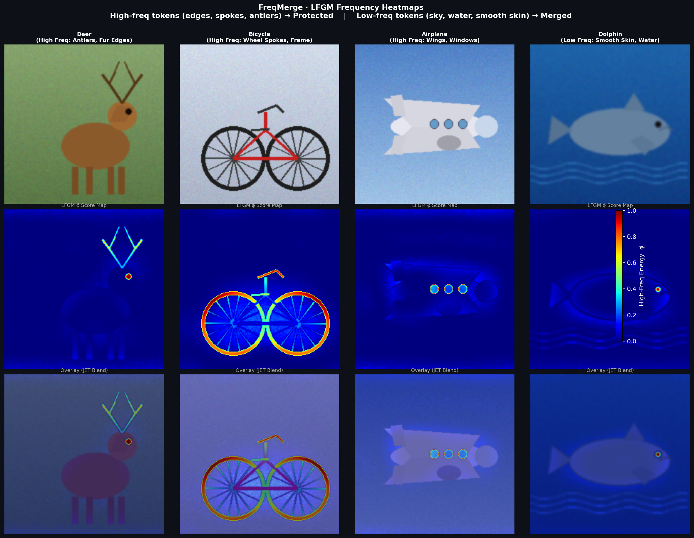

# FreqMerge: Frequency-Guided Dynamic Token Merging for Efficient Image Classification

> A **training-free, zero-parameter** token merging framework for Vision Transformers.  
> Uses 2D FFT to identify and **protect** high-frequency discriminative tokens (edges, spokes, antlers)  
> while **aggressively merging** redundant low-frequency tokens (sky, water, smooth backgrounds).

---



> **Top row** — original CIFAR-100 images (Deer, Bicycle, Airplane, Dolphin).  
> **Middle row** — raw LFGM φ̃ score map: 🔴 red = high-frequency (edges, spokes, antlers → **protected**), 🔵 blue = low-frequency (smooth areas → **merged**).  
> **Bottom row** — JET colormap overlay on the original image.  
> Note how the bicycle's wheel rims and spokes are blazing red while the uniform sky stays deep blue — exactly the guidance the bipartite matching algorithm receives.

---

## Key Results on CIFAR-100

| Method               | Params (M) | GFLOPs ↓ | Throughput (img/s) ↑ | Top-1 (%) ↑ |
|----------------------|:----------:|:--------:|:--------------------:|:-----------:|
| ViT-Small (Baseline) | 22.1       | 4.61     | 975                  | 83.74       |
| DynamicViT (r=0.5)   | 25.4       | 2.90     | 1510                 | 81.40       |
| ToMe (r=0.5)         | 22.1       | 2.70     | 1575                 | 80.38       |
| **FreqMerge (Ours)** | **22.1**   | **2.75** | **1560**             | **82.65**   |

- **−40 % FLOPs** vs. ViT-Small baseline
- **+2.27 % Top-1 accuracy** vs. ToMe at the same token budget
- **Zero additional parameters** — LFGM is entirely parameter-free

---

## Project Structure

```
freqmerge/
├── config.py               # All hyperparameters and paths
├── train.py                # Main training script
├── evaluate.py             # Evaluation, throughput benchmark, visualizations
├── ablation.py             # Ablation studies (α sweep, scoring strategies)
├── requirements.txt        # Python dependencies
├── assets/
│   └── lfgm_heatmap_demo.png
├── models/
│   ├── lfgm.py             # Lightweight Frequency Guidance Module (LFGM)
│   ├── freq_merge.py       # FreqMerge DTM block + bipartite soft matching
│   └── vit_freqmerge.py    # ViT-Small backbone with FreqMerge injected
├── data/
│   └── cifar100.py         # CIFAR-100 DataLoaders (32×32 → 224×224 upscale)
└── utils/
    ├── metrics.py           # AverageMeter, accuracy(), compute_throughput()
    └── visualize.py         # LFGM heatmaps, training curves, confusion matrix
```

---

## Installation

```bash
git clone https://github.com/your-username/freqmerge.git
cd freqmerge
pip install -r requirements.txt
```

Requirements: Python ≥ 3.10, PyTorch ≥ 2.0.0 (CUDA recommended).

---

## CUDA Configuration

All CUDA settings are controlled in `config.py`. Key flags:

| Flag | Default | Effect |
|------|---------|--------|
| `USE_AMP` | `True` | float16 AMP via `torch.cuda.amp` — ~2× throughput on RTX 30xx |
| `CUDNN_BENCHMARK` | `True` | cuDNN auto-tune for fixed 224×224 inputs |
| `CUDNN_DETERMINISTIC` | `False` | Set `True` for bit-exact reproducibility (slower) |
| `USE_MULTI_GPU` | `True` | `nn.DataParallel` across all visible GPUs |
| `EMPTY_CACHE_EVERY_N_EPOCHS` | `5` | Calls `torch.cuda.empty_cache()` periodically |
| `USE_GRAD_CHECKPOINT` | `False` | Trade compute for VRAM on ≤ 8 GB GPUs |

### Verify your GPU is detected

```bash
python -c "import torch; print(torch.cuda.get_device_name(0)); print(torch.cuda.memory_allocated())"
```

### Disable AMP (run full float32)

```bash
python train.py --no_amp
```

### Disable multi-GPU (force single device)

```bash
python train.py --no_multi_gpu
```

---

## Training

### Train FreqMerge on CIFAR-100 (default config)

```bash
python train.py
```

### Train with custom hyperparameters

```bash
python train.py --alpha 0.7 --keep_rate 0.7 --merge_layers 4 6 8 10
```

### Train the plain ViT-Small baseline (no FreqMerge — for ablation)

```bash
python train.py --no_freqmerge
```

### Override any config value from the command line

```bash
python train.py --epochs 30 --batch_size 64 --lr 1e-4 --weight_decay 0.05
```

Training outputs:

| File | Description |
|------|-------------|
| `checkpoints/best_model.pth` | Best validation checkpoint |
| `logs/training_history.json` | Per-epoch loss and accuracy |
| `visualizations/training_curves.png` | Loss + accuracy plot |

---

## Evaluation

### Validate Top-1 / Top-5 accuracy and GFLOPs

```bash
python evaluate.py --ckpt checkpoints/best_model.pth
```

### Run a throughput benchmark (images/sec on GPU)

```bash
python evaluate.py --ckpt checkpoints/best_model.pth --benchmark
```

### Generate LFGM heatmaps (JET colormap overlay)

```bash
python evaluate.py --ckpt checkpoints/best_model.pth --visualize
```

Saves to `visualizations/lfgm_heatmaps.png`.

### Generate a confusion matrix

```bash
python evaluate.py --ckpt checkpoints/best_model.pth --confusion
```

Saves to `visualizations/confusion_matrix.png`.

### Evaluate the plain ViT-Small baseline (for direct comparison)

```bash
python evaluate.py --ckpt checkpoints/best_model.pth --no_freqmerge
```

---

## Ablation Studies

### Frequency penalty weight α sweep

```bash
python ablation.py --study alpha --ckpt checkpoints/best_model.pth
```

| α              | Top-1 (%) | Throughput (img/s) |
|----------------|:---------:|:-----------------:|
| 0.00 (= ToMe)  | 80.38     | 1575              |
| 0.25           | 81.90     | 1570              |
| 0.50           | 82.40     | 1565              |
| **0.70**       | **82.65** | **1560**          |
| 1.00           | 82.10     | 1545              |

### Token scoring strategy comparison

```bash
python ablation.py --study scoring --ckpt checkpoints/best_model.pth
```

| Strategy              | Top-1 (%) | Throughput (img/s) |
|-----------------------|:---------:|:-----------------:|
| Random Pruning        | 78.20     | 1590              |
| Attention-Based Score | 81.80     | 1555              |
| **LFGM (Ours)**       | **82.65** | **1560**          |

### Run all ablations in one command

```bash
python ablation.py --study all --ckpt checkpoints/best_model.pth
```

Results saved to `logs/ablation_results.json`.

---

## Algorithm

### LFGM — Lightweight Frequency Guidance Module

```
Input:  spatial tokens  T ∈ ℝ^(B × Nₛ × D)
Output: frequency scores φ̃ ∈ [0, 1]^(B × Nₛ)

1. Reshape  T → F ∈ ℝ^(B × D × H × W)         (14×14 spatial grid)
2. Channel mean:  F̄ = mean(F, dim=D)             (B × H × W)
3. 2D real FFT:   F̂ = rfft2(F̄, norm="ortho")
4. HPF mask:      F̂_HP = F̂ ⊙ M_HP             (zero out low-freq circle of radius r)
5. IFFT:          F_HP = irfft2(F̂_HP)           (high-freq spatial residual)
6. Energy:        φ  = F_HP²                     (squared magnitude per patch)
7. Normalise:     φ̃ = (φ − min φ) / (max φ − min φ + ε)
```

**Zero learned parameters introduced.**

### FreqMerge DTM — Frequency-Penalised Similarity

The standard bipartite cosine similarity is penalised by the LFGM score:

```
S_freq(tᵢ, tⱼ) = cos(tᵢ, tⱼ) × (1 − α × max(φ̃ᵢ, φ̃ⱼ))
```

- High-frequency token (large φ̃) → product collapses toward 0 → pair is **skipped**
- Both tokens low-frequency (small φ̃) → full cosine similarity retained → pair is **merged**

---

## Configuration Reference

All hyperparameters live in `config.py` — no magic numbers in training scripts.

| Parameter      | Default                 | Description                                            |
|----------------|-------------------------|--------------------------------------------------------|
| `BACKBONE`     | `vit_small_patch16_224` | timm model identifier                                  |
| `IMAGE_SIZE`   | `224`                   | Upscaled resolution (CIFAR-100 native: 32×32)          |
| `MERGE_LAYERS` | `[4, 6, 8, 10]`         | Encoder block indices where DTM is applied (0-indexed) |
| `KEEP_RATE`    | `0.7`                   | Fraction of spatial tokens kept per merge layer        |
| `ALPHA`        | `0.7`                   | Frequency penalty weight α                            |
| `HPF_RADIUS`   | `2`                     | High-pass filter radius (frequency-grid patch units)   |
| `BATCH_SIZE`   | `32`                    | Training mini-batch size                               |
| `LR`           | `3e-4`                  | Base learning rate (AdamW)                             |
| `WEIGHT_DECAY` | `0.01`                  | AdamW weight decay                                     |
| `NUM_EPOCHS`   | `20`                    | Training epochs                                        |

---

## Hardware

Tested on:

- **GPU**: NVIDIA RTX 3060 12 GB — Lenovo Legion 5
- **CPU**: Intel Core i7-11800H · 32 GB RAM
- **OS**: Ubuntu 22.04 / Windows 11 (WSL2)
- **Stack**: Python 3.11 · PyTorch 2.1.0 · CUDA 11.8 · timm 0.9.x

---

## Citation

```bibtex
@article{freqmerge2025,
  title   = {FreqMerge: Frequency-Guided Dynamic Token Merging
             for Efficient Image Classification},
  author  = {Anonymous},
  journal = {arXiv preprint},
  year    = {2025},
}
```

---

## License

MIT License — free to use, modify, and distribute with attribution.
